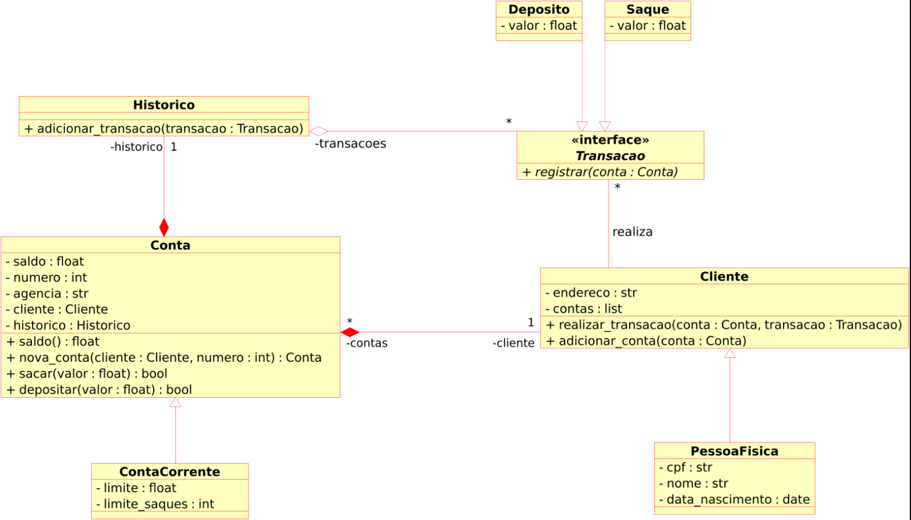

# Objetivo Geral

Iniciar a modelagem do sistema bancário em POO.
Adicionar classes para cliente e as operações bancárias: depósito e saque

## Desafio

Atualizar a implementação do sistema bancário, para armazenar os dados de cliente s e contas bancárias em objetos ao invés de dicionários.
O código deve seguir o modelo de classes UML a seguir:

## Desafio extra

Após concluir a modelagem das classes e a criação dos métodos. Atualizar os mérodos que tratam opçções do menu, para funcionarem com as classes modeladas
